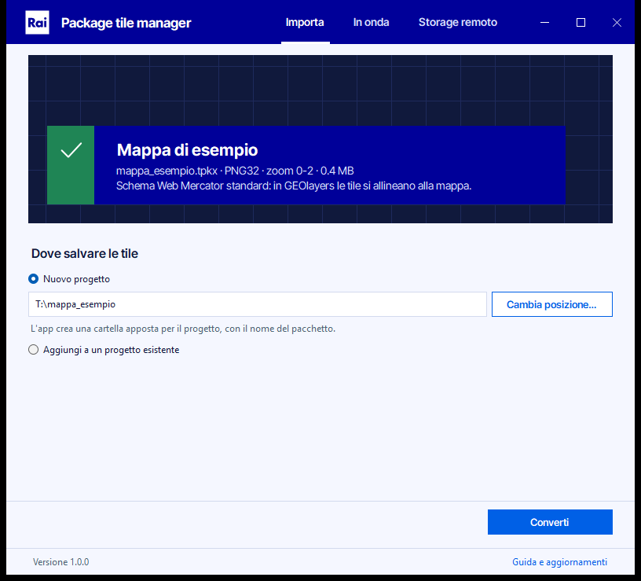
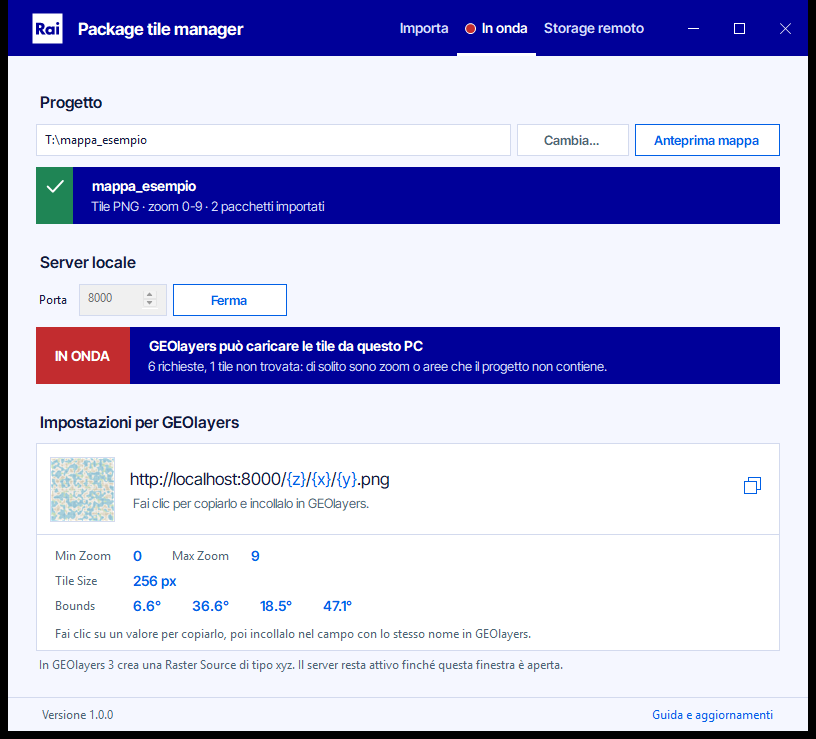
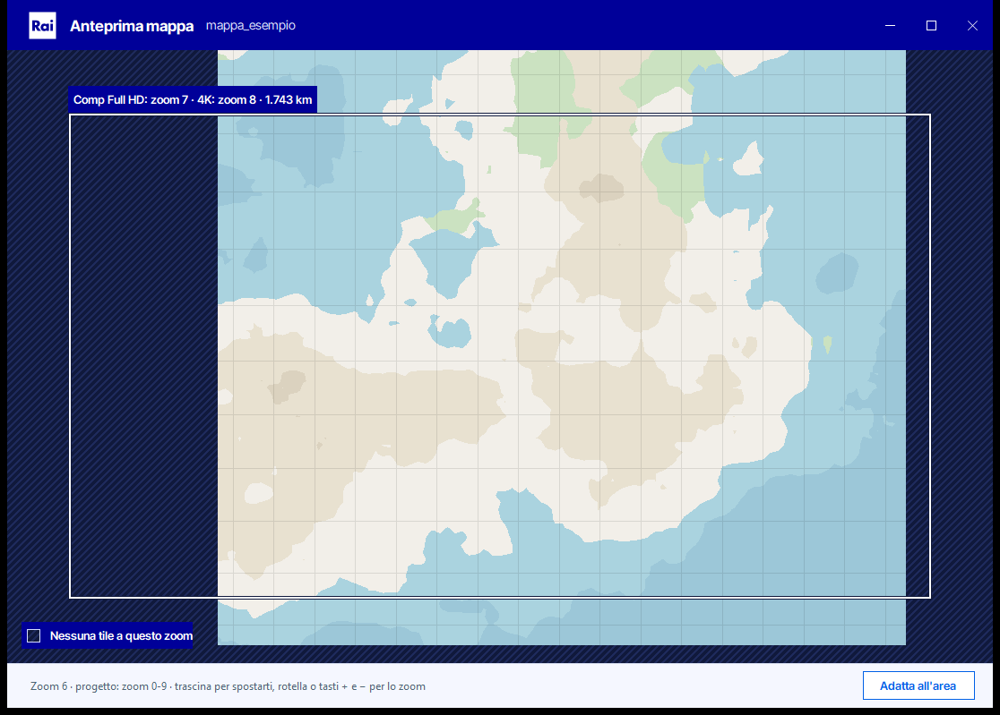

# Rai - Package tile manager

Converte un tile package esportato da ArcGIS Pro (`.tpkx` o `.tpk`) in una cartella di tile `{z}/{x}/{y}` e la serve a GEOlayers 3 in After Effects, dal PC su cui gira oppure da un web server.



Le immagini usano un pacchetto di esempio sintetico.

Prende il posto dello script Python e di `python -m http.server`. Si usa senza riga di comando, e prima di convertire controlla che le tile si allineino alla mappa di GEOlayers.

## Scaricare e avviare

Scarica `rai-package-tile-manager.zip` dalla pagina [Releases](https://github.com/bitoesposito/rai-tile-package-manager/releases/latest), estrai i file e apri `Rai - Package tile manager.exe` con un doppio clic. L'app non va installata: usa .NET Framework 4.8, già presente in Windows 10 e 11.

L'exe non è firmato digitalmente, quindi al primo avvio Windows SmartScreen può mostrare "PC protetto da Windows". In quel caso fai clic su "Ulteriori informazioni" e poi su "Esegui comunque".

Puoi anche trascinare un pacchetto, ed eventualmente la cartella di un progetto, direttamente sull'icona dell'exe.

## Come si usa

L'app ha tre schede, nella banda blu in alto insieme ai pulsanti della finestra.

### Importa

1. Trascina il pacchetto sul riquadro scuro, oppure fai clic sul riquadro e sceglilo. L'app legge lo schema di tassellatura e ti dice subito se il pacchetto funziona in GEOlayers.
2. In "Dove salvare le tile" scegli fra due strade.
   - Nuovo progetto: l'app crea una cartella apposta, con il nome del pacchetto, dentro la posizione indicata. All'inizio la posizione è la cartella del pacchetto e la cambi con "Cambia posizione…". Se scegli il Desktop, le tile finiscono in `Desktop\nome_del_pacchetto` e mai sparse sul Desktop; se quel nome è già usato, la cartella diventa `nome_del_pacchetto (2)`.
   - Aggiungi a un progetto esistente: scegli la cartella di un progetto creato in precedenza. Il funzionamento è spiegato più sotto.
3. Premi "Converti". Alla fine lo stesso pulsante diventa "Metti in onda" e ti porta alla scheda successiva con il server già avviato.

### In onda



Qui scegli il progetto da servire e la porta, 8000 di default. Dopo una conversione l'app propone il progetto appena creato e, alla riapertura, l'ultimo usato. Con "Metti in onda" parte il server locale: il riquadro rosso IN ONDA conferma che GEOlayers può caricare le tile e conta le richieste che arrivano, e un pallino rosso accanto alla scheda lo ricorda anche dalle altre schede.

Il riquadro sotto mostra una tile del progetto e l'URL da usare in GEOlayers. Fai clic sul riquadro per copiarlo negli appunti:

```
http://localhost:8000/{z}/{x}/{y}.png
```

Se converti un altro pacchetto mentre un progetto è in onda, "Metti in onda" mette in onda quello nuovo sulla stessa porta, quindi l'URL in GEOlayers non cambia.

Il server risponde solo a questo PC (127.0.0.1 e ::1), quindi non servono permessi di amministratore e Windows non chiede di aprire il firewall. Resta attivo finché la finestra è aperta.

Anche una cartella di rete (`\\server\condivisione\...`) si usa da qui: sceglila come progetto e l'app la serve con il server locale.

### Anteprima mappa



Nella scheda In onda, "Anteprima mappa" apre il progetto in una finestra a parte. Le tile arrivano direttamente dalla cartella, quindi il server può anche essere fermo. Trascina per spostarti e cambia zoom con la rotella, con i tasti + e − o con un doppio clic; "Adatta all'area" torna all'extent del progetto. Dove il progetto non ha tile a quello zoom, la mappa è tratteggiata.

Il riquadro al centro è l'area che entra in una comp Full HD quando GEOlayers mostra le tile a dimensione reale. L'etichetta sopra indica lo zoom che serve, quello per una comp 4K e la larghezza dell'area. Uno zoom che il progetto non ha è segnato con "manca", e se manca quello per il Full HD anche il riquadro diventa arancione: esporta un pacchetto con zoom più dettagliati e aggiungilo al progetto.

### Storage remoto

Quando le tile del progetto saranno pubblicate su un web server, inserisci l'indirizzo della cartella del progetto, per esempio `https://tiles.azienda.it/mappa`, e premi "Verifica connessione". L'app scarica una tile del progetto scelto nella scheda In onda e la confronta con quella su disco. Se il server risponde, compare il riquadro con l'URL da copiare per GEOlayers e l'app ricorda l'indirizzo nel progetto.

## Usare le tile in GEOlayers 3

In GEOlayers 3 crea una Raster Source di tipo xyz. La scheda In onda mostra i valori da inserire, già convertiti: fai clic su un valore per copiarlo e incollalo nel campo con lo stesso nome.

- URI: l'URL del server, per esempio `http://localhost:8000/{z}/{x}/{y}.png`. Funziona quando il progetto è in onda.
- Min Zoom e Max Zoom: il primo e l'ultimo zoom del progetto.
- Tile Size: 256 px, la dimensione delle tile del progetto. Con 512 px GEOlayers le mostra ingrandite al doppio e meno nitide.
- Bounds: l'extent impostata in ArcGIS Pro, convertita da Web Mercator in gradi, nell'ordine ovest, sud, est, nord. Se il progetto contiene più pacchetti, i bounds li comprendono tutti.

L'app registra i bounds quando un pacchetto entra nel progetto. Se mancano, per esempio in un progetto creato con il vecchio script, aggiungi di nuovo i pacchetti dalla scheda Importa: le tile già presenti restano come sono e l'app calcola i bounds.

## Aggiungere tile a un progetto esistente

Serve quando esporti da ArcGIS Pro un secondo pacchetto della stessa mappa, per esempio una zona più piccola con zoom più dettagliati, e vuoi continuare a usare un solo URL in GEOlayers.

Con lo schema Web Mercator le coordinate `{z}/{x}/{y}` valgono per tutto il mondo, quindi pacchetti con estensioni diverse si incastrano da soli e l'estensione in sé non va controllata. L'app controlla invece tre cose che possono rovinare un progetto.

- Lo schema di tassellatura deve essere quello di ArcGIS Online, Bing Maps e Google Maps. Vale per ogni pacchetto, anche per il primo.
- Il formato delle immagini deve essere lo stesso, PNG con PNG e JPEG con JPEG, perché GEOlayers usa un URL con una sola estensione.
- I livelli in comune vanno trattati con attenzione. Un pacchetto di un'area piccola contiene anche gli zoom bassi, quasi vuoti fuori dalla sua area: se sostituisse le tile del progetto, a quegli zoom sparirebbe il resto della mappa. Per questo di default l'app tiene le tile già presenti e aggiunge solo quelle che mancano. "Sostituisci le tile in comune" serve quando hai riesportato la stessa mappa e vuoi aggiornarla.

Prima di convertire l'app mostra quali zoom aggiunge il pacchetto, quali ci sono già e se lo stesso file è già stato importato.

## Cosa c'è nella cartella di un progetto

```
mappa/
├── metadata.json
├── 0/
│   └── 0/
│       └── 0.png
├── 1/
│   ├── 0/
│   │   ├── 0.png
│   │   └── 1.png
│   └── 1/
...
```

`metadata.json` registra il formato delle tile, l'indirizzo remoto verificato e lo storico dei pacchetti importati (file, nome, zoom, extent in gradi e data). Anche le cartelle create con il vecchio script Python, che contengono solo le cartelle degli zoom, vengono riconosciute come progetti. Una cartella qualsiasi, come il Desktop o Documenti, non lo è mai.

## Problemi comuni

### Il pacchetto viene rifiutato per il sistema di riferimento, l'origine o la scala

GEOlayers lavora in Web Mercator. In ArcGIS Pro, nello strumento "Crea pacchetto tile mappa", scegli lo schema di tassellatura "ArcGIS Online / Bing Maps / Google Maps" e riesporta il pacchetto.

### GEOlayers non mostra nulla

Nella scheda In onda il riquadro deve dire IN ONDA. Se il contatore delle richieste resta a zero, l'URL in GEOlayers non è quello copiato dall'app: controlla porta ed estensione. Se salgono le tile non trovate, GEOlayers sta chiedendo zoom o zone che il progetto non contiene.

### La porta 8000 è occupata

La sta usando un altro programma, per esempio un `python -m http.server` rimasto aperto, oppure Windows l'ha riservata. Scegli un'altra porta e aggiorna l'URL in GEOlayers.

### La cartella di rete non è raggiungibile

L'app controlla la cartella appena la scegli e di nuovo prima di scrivere. Verifica la connessione al NAS o all'unità di rete e i permessi di scrittura.

### Pacchetti di ArcMap o di quote

I pacchetti Compact Cache V1, creati con ArcMap, e quelli di quote in formato LERC non sono supportati. Riesporta con ArcGIS Pro in PNG o in JPEG.

## Sviluppo

Il codice è C# per WinForms su .NET Framework 4.8. Per compilare serve il .NET SDK 10, su Windows oppure su Linux o WSL:

```bash
dotnet build src -c Release
```

L'exe compilato è `src/bin/Release/net48/Rai - Package tile manager.exe`.

Il self-check crea pacchetti sintetici e verifica lettura dei bundle, regole delle cartelle, aggiunta a un progetto e server. Gira anche su Linux:

```bash
dotnet run --project tests
```

| File | Contenuto |
|---|---|
| `src/TilePackage.cs` | Lettura del pacchetto, controllo dello schema e conversione dei bundle |
| `src/TileFolder.cs` | Cartelle dei progetti: riconoscimento, cartella dedicata, `metadata.json` |
| `src/TileServer.cs` | Server locale e verifica dello storage remoto |
| `src/Ui.cs` | Design system: colori, font, sottopancia, monitor, schede, pulsanti, logo, barra del titolo, riquadro dell'URL |
| `src/MainForm.cs` | La finestra con le tre schede |
| `src/MapPreview.cs` | Anteprima della mappa: tile del progetto, tratteggio dove mancano, riquadro della comp |
| `src/FolderPicker.cs` | Selettore di cartelle di Esplora file |
| `src/icon.svg` | L'icona dell'app; `src/app.ico` ne contiene le versioni da 16 a 256 px |

A ogni push GitHub Actions esegue il self-check e compila l'exe, che si scarica dagli artifact della run. Per pubblicare una versione crea un tag `vX.Y.Z` e fai push del tag: nella release finisce uno zip con l'exe e la licenza del font. Se sposti un tag già pubblicato e rifai il push con `-f`, la release tiene la sua descrizione e lo zip viene sostituito. `PRODUCT.md` e `DESIGN.md` descrivono il prodotto e il design system.

## Dettagli tecnici

Un tile package è uno zip con i bundle in formato Compact Cache V2 e i metadati (`root.json` nei `.tpkx`, `conf.xml` nei `.tpk`). Ogni bundle `L{livello}/R{riga}C{colonna}.bundle` contiene un blocco di 128×128 tile: dopo un'intestazione di 64 byte c'è un indice di record da 8 byte, con l'offset della tile nei 40 bit bassi e la dimensione nei 24 alti. Il livello diventa `z`, la colonna `x` e la riga `y`. Riga e colonna sono in esadecimale e oltre lo zoom 16 usano più di quattro cifre: il vecchio script ne leggeva quattro e perdeva quei livelli.

L'app legge i bundle in streaming, senza caricarli interi in memoria, e ne elabora fino a otto in parallelo. Il formato delle tile e l'estensione dei file vengono dai metadati del pacchetto.

## Copyright

Copyright © Esri Italia.

Il font Inter Tight, incorporato nell'exe, è distribuito con licenza SIL Open Font License 1.1 (`src/fonts/OFL.txt`). Il logo Rai nell'intestazione è il marchio pubblicato sul sito rai.it e i colori dell'interfaccia vengono da rai.it e rainews.it; Rai e il logo Rai sono marchi registrati di RAI Radiotelevisione italiana S.p.A. L'icona dell'app è disegnata in `src/icon.svg` e convertita in `src/app.ico`.
